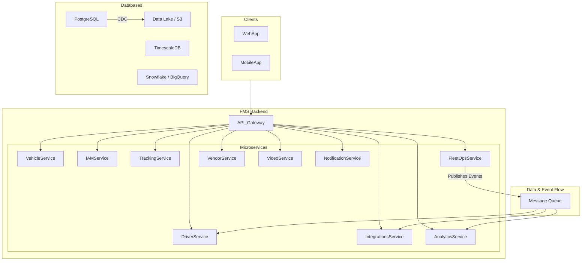

# Synapse Fleet

> The Intelligent Core of Your Fleet.

**Synapse Fleet** is an intelligent, developer-first fleet management platform designed to turn operational data into dollars. We go beyond simple tracking to offer predictive maintenance, real-time telematics, and broad ecosystem integrations, helping you prevent failures before they happen and run a safer, more profitable fleet.

This repository contains the backend microservices that power the Synapse Fleet platform.

---

## ✨ Core Features

- **Unified Platform:** Manage every aspect of your fleet—vehicles, drivers, safety, compliance, and maintenance—from a single command center.
- **AI-Powered Safety:** Go beyond simple tracking with an integrated video telematics solution that automatically detects risky behavior and helps you coach drivers.
- **Predictive Maintenance:** Leverage machine learning on real-time telematics data to forecast vehicle health and prevent costly, unplanned downtime.
- **Complete Driver Lifecycle:** Streamline everything from driver recruiting and onboarding to document management, HOS compliance, and automated payroll settlements.
- **Developer-First Ecosystem:** Build anything with a robust REST API, real-time event streaming via webhooks, and a growing marketplace of pre-built integrations.

## 🏛️ Architecture Overview

Synapse Fleet is built on a modern **Microservices Architecture** to ensure scalability, reliability, and maintainability. Each service is a domain expert, responsible for a distinct business capability. This allows for independent development, deployment, and scaling to meet enterprise demands.



## 🚀 Getting Started (Development)

Follow these steps to get the backend services running on your local machine.

### Prerequisites

- Git
- Docker and Docker Compose
- Node.js (v18.x or later)

### 1. Clone the Repository

```bash
git clone <repository_url>
cd synapse-fleet-backend
```

### 2. Run the Environment

The entire local environment is managed by Docker Compose. This command will build and start all the microservices and databases.

```bash
# Start all services in the background
docker-compose up -d
```

Your API Gateway will be available at `http://localhost:3000`.

## 💻 Technology Stack

- **Backend Services:** Node.js with TypeScript (primarily using NestJS)
- **Databases:** PostgreSQL for relational data, TimescaleDB for time-series data.
- **Infrastructure:** Docker for containerization, Kubernetes for orchestration.
- **Communication:** REST APIs, gRPC, and a Message Queue (RabbitMQ/Kafka) for asynchronous events.

## 📂 Project Structure

The monorepo is organized by service:

```
/synapse-fleet-backend
├── /services             # Contains each microservice
│   ├── /iam-service
│   ├── /vehicle-service
│   └── ...
├── /libs                 # Shared libraries and utilities
├── docker-compose.yml    # Local environment definition
└── README.md             # You are here!
```
