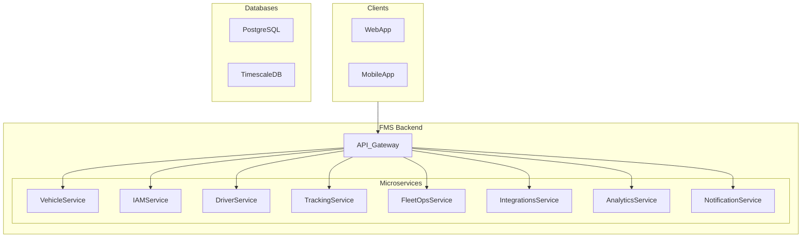

# Synapse Fleet

> The Intelligent Core of Your Fleet.

**Synapse Fleet** is an intelligent, developer-first fleet management platform designed to turn operational data into dollars. We go beyond simple tracking to offer predictive maintenance, real-time telematics, and broad ecosystem integrations, helping you prevent failures before they happen and run a safer, more profitable fleet.

This repository contains the backend microservices that power the Synapse Fleet platform.

---

## ✨ Core Features

- **Real-Time Telematics:** Live GPS tracking, AI-powered dash cams, and driver behavior monitoring.
- **Predictive Analytics:** Leverage machine learning to forecast maintenance needs and prevent costly downtime.
- **Compliance Automation:** Effortless Hours of Service (HOS) logging with our FMCSA-registered ELD solution.
- **Operations Management:** Advanced tools for multi-stop route optimization and service order dispatching.
- **Developer-First:** A robust REST API, real-time webhooks, and pre-built connectors to integrate with any system.
- **Multi-Tenancy:** Secure, isolated environments for each customer's data.

## 🏛️ Architecture Overview

Synapse Fleet is built on a **Microservices Architecture** to ensure scalability, reliability, and maintainability. Each service is responsible for a distinct business capability and can be developed, deployed, and scaled independently.



## 🚀 Getting Started (Development)

Follow these steps to get the backend services running on your local machine.

### Prerequisites

- Git
- Docker and Docker Compose
- Node.js (v18.x or later)

### 1. Clone the Repository

```bash
git clone <repository_url>
cd synapse-fleet-backend
```

### 2. Run the Environment

The entire local environment is managed by Docker Compose. This command will build and start all the microservices and databases.

```bash
# Start all services in the background
docker-compose up -d
```

Your API Gateway will be available at `http://localhost:3000`.

## 💻 Technology Stack

- **Backend Services:** Node.js with TypeScript (primarily using NestJS)
- **Databases:** PostgreSQL for relational data, TimescaleDB for time-series data.
- **Infrastructure:** Docker for containerization, Kubernetes for orchestration.
- **Communication:** REST APIs, gRPC, and a Message Queue (RabbitMQ/Kafka) for asynchronous events.

## 📂 Project Structure

The monorepo is organized by service:

```
/synapse-fleet-backend
├── /services             # Contains each microservice
│   ├── /iam-service
│   ├── /vehicle-service
│   └── ...
├── /libs                 # Shared libraries and utilities
├── docker-compose.yml    # Local environment definition
└── README.md             # You are here!
```
