# database_schema.md

# Synapse Fleet - Database Schema

**Version:** 1.0
**Date:** 2025-12-17

## 1. Introduction

This document defines the database schema for Synapse Fleet. It includes table definitions, column types, and relationships.

## 2. Entity-Relationship Diagram (ERD)

_(This section would typically contain a visual ERD. The Mermaid diagram below provides a code-based representation.)_

```mermaid
erDiagram
    COMPANIES {
        int company_id PK
        varchar name
        varchar country
        varchar timezone
        varchar currency
    }
    DRIVERS {
        int driver_id PK
        varchar name
        varchar license_number
        date license_expiry
        varchar contact_info
        varchar status
    }
    COMPANIES ||--o{ DRIVERS : "employs"
    VEHICLES {
        int vehicle_id PK
        varchar vin
        varchar make
        varchar model
        int year
        varchar license_plate
    }
    COMPANIES ||--o{ VEHICLES : "owns"
    PLACES {
        int place_id PK
        varchar name
        point location
        text address
    }
    SERVICE_ORDERS {
        int order_id PK
        int driver_id FK
        int vehicle_id FK
        datetime start_time
        datetime end_time
        varchar status
    }
    COMPANIES ||--o{ SERVICE_ORDERS : "creates"
    PAYLOADS {
        int payload_id PK
        int order_id FK
        int pickup_place_id FK
        int dropoff_place_id FK
        text description
        int weight
    }
    GPS_DATA {
        timestamp time PK
        int vehicle_id FK
        float latitude
        float longitude
        float speed
    }
    MAINTENANCE_LOGS {
        int log_id PK
        int vehicle_id FK
        date service_date
        varchar service_type
        text description
        decimal cost
    }
    HOS_LOGS {
        int log_id PK
        int driver_id FK
        datetime event_time
        varchar status
        text notes
    }
    DVIR_REPORTS {
        int report_id PK
        int vehicle_id FK
        int driver_id FK
        datetime inspection_time
        text defects_found
    }
    API_KEYS {
        int key_id PK
        int company_id FK
        varchar name
        varchar secret_key_hash
        datetime last_used_at
    }
    WEBHOOKS {
        int webhook_id PK
        int company_id FK
        varchar url
        varchar event_type
    }
    WEBHOOK_DELIVERY_LOGS {
        int log_id PK
        int webhook_id FK
        datetime attempt_time
        int status_code
        varchar status
        text response_body
    }
    DOCUMENTS {
        int document_id PK
        int company_id FK
        int driver_id FK
        int vehicle_id FK
        varchar type
        varchar storage_path
        date expiry_date
    }
    DRIVER_SETTLEMENTS {
        int settlement_id PK
        int driver_id FK
        date pay_period_start
        date pay_period_end
        decimal gross_pay
        decimal total_deductions
        decimal total_reimbursements
        decimal net_pay
        varchar status
        date payment_date
    }
    SETTLEMENT_DEDUCTIONS {
        int deduction_id PK
        int settlement_id FK
        varchar description
        decimal amount
    }
    SETTLEMENT_REIMBURSEMENTS {
        int reimbursement_id PK
        int settlement_id FK
        varchar description
        decimal amount
    }
    VEHICLE_HEALTH_PREDICTIONS {
        int prediction_id PK
        int vehicle_id FK
        varchar component
        date predicted_failure_date
        float confidence_score
        varchar status
    }
    DAILY_VEHICLE_STATS {
        int stat_id PK
        int vehicle_id FK
        date date
        float distance_km
        int idle_minutes
    }
    COMPANIES ||--o{ API_KEYS : "has"
    COMPANIES ||--o{ WEBHOOKS : "configures"

    VEHICLES ||--o{ VEHICLE_HEALTH_PREDICTIONS : "has"

    WEBHOOKS ||--o{ WEBHOOK_DELIVERY_LOGS : "has"

    DRIVERS ||--o{ DOCUMENTS : "has"
    DRIVERS ||--o{ DRIVER_SETTLEMENTS : "receives"

    DRIVER_SETTLEMENTS ||--o{ SETTLEMENT_DEDUCTIONS : "has"
    DRIVER_SETTLEMENTS ||--o{ SETTLEMENT_REIMBURSEMENTS : "has"

    VEHICLES ||--o{ DAILY_VEHICLE_STATS : "has"

    DRIVERS ||--o{ SERVICE_ORDERS : "assigned to"
    VEHICLES ||--o{ SERVICE_ORDERS : "used for"
    VEHICLES ||--o{ GPS_DATA : "generates"
    VEHICLES ||--o{ MAINTENANCE_LOGS : "has"
    DRIVERS ||--o{ HOS_LOGS : "records"
    DRIVERS ||--o{ DVIR_REPORTS : "submits"
    VEHICLES ||--o{ DVIR_REPORTS : "is inspected in"
    SERVICE_ORDERS }|--|| PAYLOADS : "contains"
    PLACES }|--o{ PAYLOADS : "is pickup for"
    PLACES }|--o{ PAYLOADS : "is dropoff for"
```

## 3. Table Definitions

### `drivers`

Stores information about each driver.
| Column | Data Type | Constraints | Description |
|---|---|---|---|
| `driver_id` | `SERIAL` | `PRIMARY KEY` | Unique identifier for the driver. |
| `name` | `VARCHAR(255)` | `NOT NULL` | Full name of the driver. |
| `license_number` | `VARCHAR(100)` | `UNIQUE NOT NULL` | Driver's license number. |
| ... | ... | ... | ... |

### `vehicles`

Stores information about each vehicle in the fleet.
| Column | Data Type | Constraints | Description |
|---|---|---|---|
| `vehicle_id` | `SERIAL` | `PRIMARY KEY` | Unique identifier for the vehicle. |
| `vin` | `VARCHAR(17)` | `UNIQUE NOT NULL` | Vehicle Identification Number. |
| `make` | `VARCHAR(100)` | | Manufacturer of the vehicle. |
| ... | ... | ... | ... |

### `gps_data` (TimescaleDB Hypertable)

Stores time-series location data from telematics devices.
| Column | Data Type | Constraints | Description |
|---|---|---|---|
| `time` | `TIMESTAMPTZ` | `NOT NULL` | Timestamp of the GPS reading. |
| `vehicle_id` | `INTEGER` | `FOREIGN KEY (vehicles)` | ID of the vehicle. |
| `latitude` | `DOUBLE PRECISION`| `NOT NULL` | Latitude coordinate. |
| `longitude` | `DOUBLE PRECISION`| `NOT NULL` | Longitude coordinate. |

_(...continue for all other tables: `trips`, `maintenance_logs`, etc.)_

## 4. Data Dictionary

- **VIN (Vehicle Identification Number):** A unique 17-character code used to identify individual motor vehicles.
- **HOS (Hours of Service):** Regulations that govern the working hours of anyone operating a commercial motor vehicle.
- **DVIR (Driver Vehicle Inspection Report):** A formal report that documents the results of a driver's vehicle inspection.
